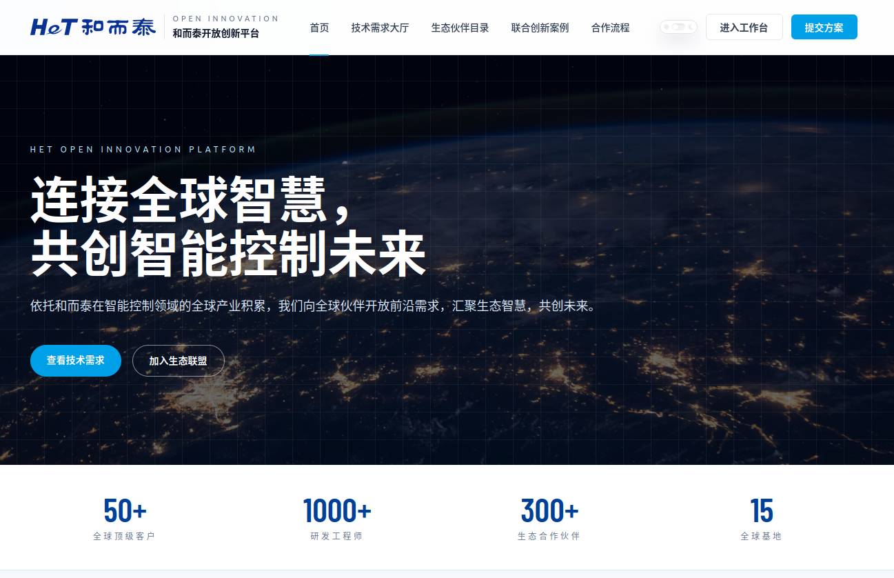
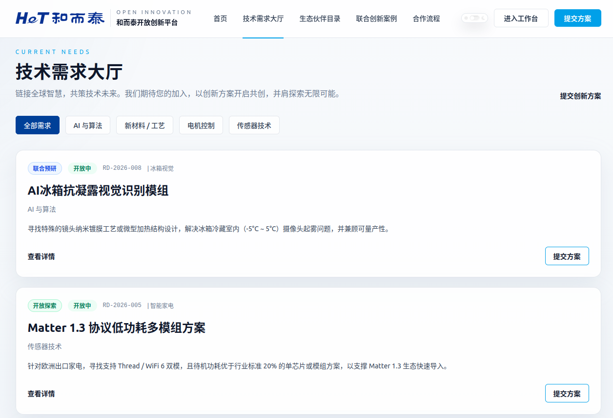
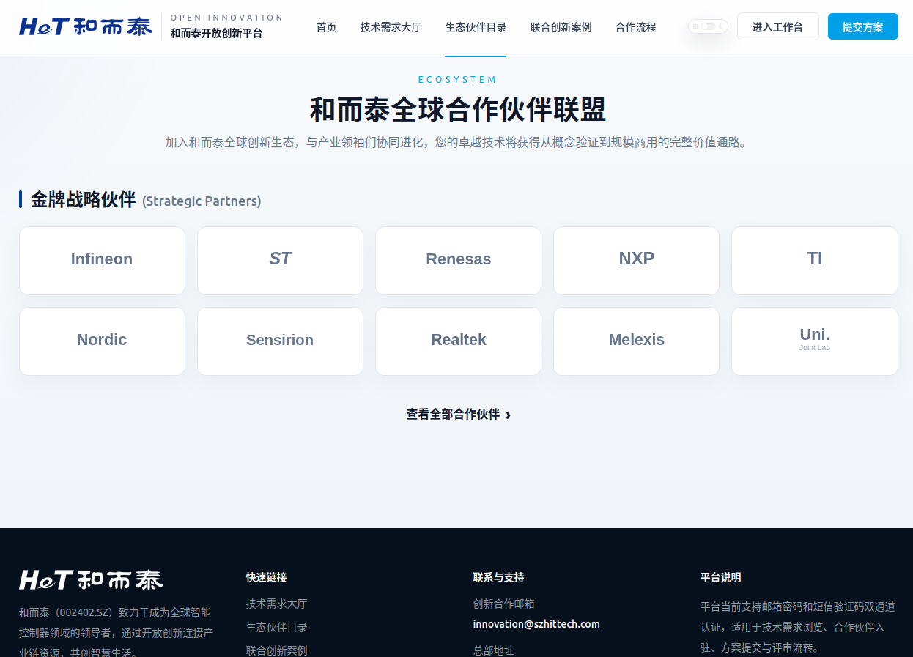
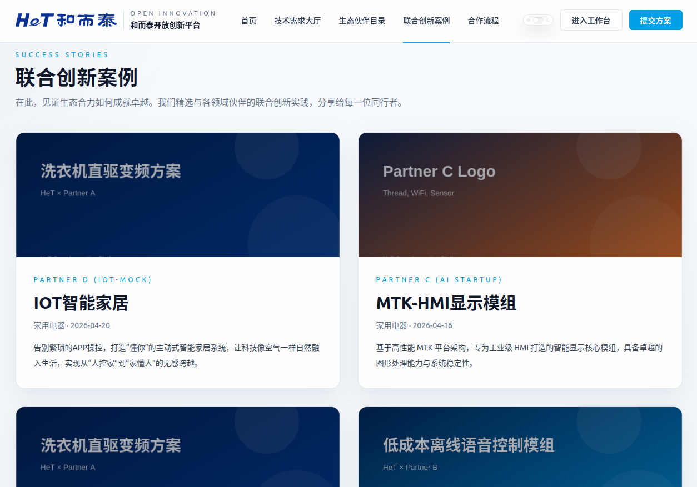
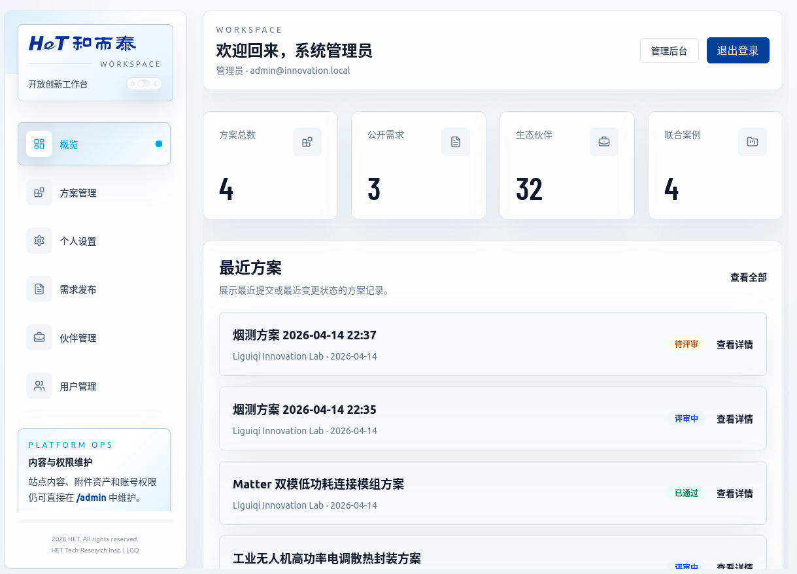
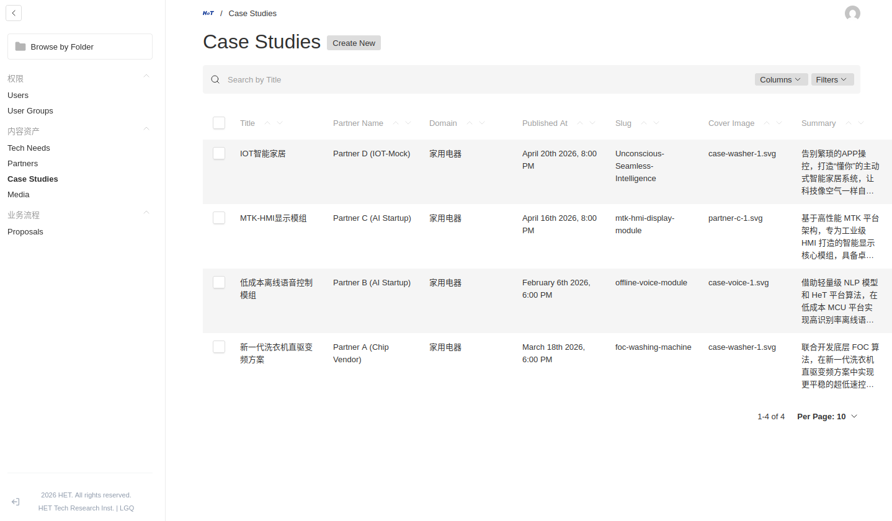
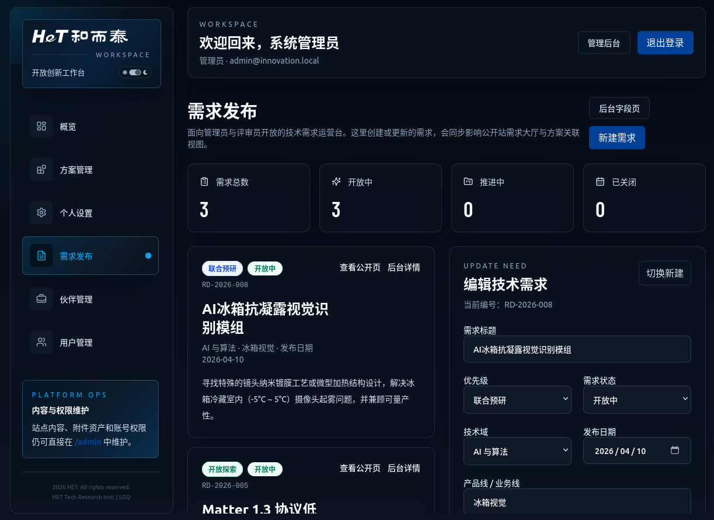
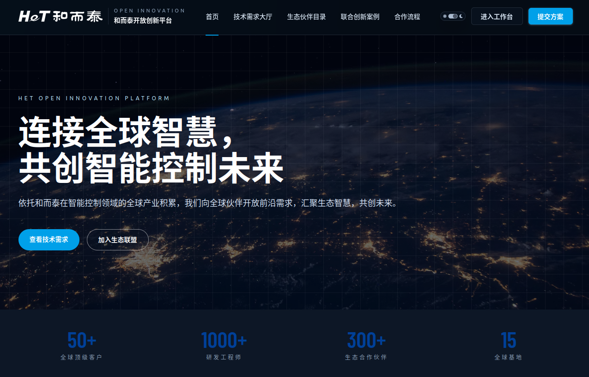

# 开放创新平台

[](LICENSE)
[](https://nextjs.org)
[](https://payloadcms.com)

**[English](README.md)**

基于 **Next.js 16 + Payload CMS 3 + PostgreSQL + Redis** 构建的企业级开放创新协作平台，统一承载公开门户、认证中心、创新工作台和后台管理。

---

## 截图预览

<table>
  <tr>
    <td align="center"><b>公开站首页</b></td>
    <td align="center"><b>技术需求大厅</b></td>
  </tr>
  <tr>
    <td></td>
    <td></td>
  </tr>
  <tr>
    <td align="center"><b>生态伙伴目录</b></td>
    <td align="center"><b>联合创新案例</b></td>
  </tr>
  <tr>
    <td></td>
    <td></td>
  </tr>
  <tr>
    <td align="center"><b>创新工作台</b></td>
    <td align="center"><b>Admin后台</b></td>
  </tr>
  <tr>
    <td></td>
    <td></td>
  </tr>
  <tr>
    <td align="center"><b>创新工作台 暗主题</b></td>
    <td align="center"><b>首页 暗主题</b></td>
  </tr>
  <tr>
    <td></td>
    <td></td>
  </tr>
</table>

---

## 功能模块

### 公开站

- 首页 Hero 区与 CTA 入口 (`/`)
- 技术需求大厅，支持搜索与筛选 (`/needs`、`/needs/[id]`)
- 生态伙伴目录 (`/ecosystem`)
- 联合创新案例展示 (`/cases`、`/cases/[slug]`)
- 合作流程说明 (`/process`)
- 方案提交入口 (`/submit`)

### 认证中心

- 邮箱 / 手机号 + 密码登录
- 邮箱 / 短信验证码登录
- 多渠道注册（邮箱验证、短信验证、或双验证）
- 全站统一深浅主题支持

### 创新工作台

- Dashboard 概览 (`/dashboard`)
- 方案管理 (`/dashboard/proposals`)
- 新建方案，支持多附件上传 (`/dashboard/proposals/new`)
- 方案详情与评审流转 (`/dashboard/proposals/[id]`)
- 个人设置 (`/dashboard/settings`)
- 伙伴管理 (`/dashboard/partners`)
- 用户管理 (`/dashboard/users`)

### 后台管理

- 品牌化 Payload Admin 面板 (`/admin`)
- Collection 管理：`users`、`user-groups`、`tech-needs`、`proposals`、`partners`、`case-studies`、`media`

---

## 技术栈

| 层 | 技术方案 |
|----|---------|
| Web 框架 | Next.js 16.2.3 |
| CMS / 数据访问 | Payload CMS 3.82.1 |
| 前端 | React 19 + Tailwind CSS 4 |
| 数据库 | PostgreSQL |
| OTP 缓存 | Redis |
| 邮件 | nodemailer + SMTP |
| 短信 | 阿里云 SMS |
| 进程守护 | systemd |
| 反向代理 | nginx |
| 运行模式 | `next build` standalone + `pnpm start` |

请求链路：

```text
Browser -> nginx :443 -> systemd service -> .next/standalone/server.js
  -> Next.js App Router / Payload Local API -> PostgreSQL / Redis / media/
```

---

## 快速开始

### 环境要求

- Node.js >= 18.20.2 或 >= 20.9.0
- pnpm >= 9
- Docker（用于 PostgreSQL 和 Redis）

### 安装步骤

```bash
pnpm install
pnpm db:up          # 通过 Docker 启动 PostgreSQL + Redis
pnpm generate:types
pnpm generate:importmap
pnpm seed           # 初始化种子数据
pnpm dev            # 启动开发服务器
```

默认开发地址：

- 公开站：`http://localhost:3000`
- 工作台：`http://localhost:3000/dashboard`
- 后台：`http://localhost:3000/admin`

### 常用命令

```bash
pnpm lint           # ESLint + oxlint 代码检查
pnpm typecheck      # TypeScript 类型检查
pnpm build          # 生产构建
pnpm test:int       # 集成测试
pnpm test:e2e       # E2E 测试（Playwright）
```

---

## 项目结构

```text
src/
  app/              # Next.js App Router 页面与 API 路由
    (public)/       # 公开站页面
    (auth)/         # 登录、注册、邮箱验证
    (dashboard)/    # 创新工作台
    (payload)/      # Payload CMS 后台
    api/            # REST API 路由（auth、proposals、sms 等）
  collections/      # Payload CMS Collection 定义
  components/       # React 组件（shared、layout、auth、dashboard、payload）
  hooks/            # Payload Hooks（通知、状态流转、媒体同步）
  lib/              # 工具库（auth、env、theme、validators 等）
  services/         # 外部服务（邮件、Redis、短信、限流）
  scripts/          # 种子数据与维护脚本
  migrations/       # 数据库迁移
deploy/             # nginx 配置、systemd 服务文件
docs/               # 架构、部署、运维与进度文档
public/branding/    # 品牌资源（Logo、Favicon）
```

---

## 环境变量

复制 `.env.example` 并填写配置：

```bash
PAYLOAD_SECRET=               # 至少 32 位
NEXT_PUBLIC_SERVER_URL=       # 如 http://localhost:3000
DATABASE_URI=                 # PostgreSQL 连接字符串
REDIS_URL=                    # Redis 连接字符串
SMTP_HOST=                    # SMTP 服务器
SMTP_USER= / SMTP_PASS=       # SMTP 凭证
ALIYUN_SMS_ACCESS_KEY_ID=     # 阿里云短信（可选）
ALIYUN_SMS_ACCESS_KEY_SECRET= # 阿里云短信（可选）
```

---

## 生产部署

详见 [docs/deployment/deployment.md](docs/deployment/deployment.md)。

快速参考：

- systemd：`deploy/systemd/innovation-platform.service`
- nginx：`deploy/nginx/innovation.example.com.conf`
- 应用端口：`3005`
- 媒体存储：项目根目录 `media/`

> **注意：** 生产环境使用 `.next/standalone` 运行。修改环境变量后，必须重新执行 `pnpm build` 并重启服务才能生效。

---

## 文档导航

- [文档总索引](docs/README.md)
- [架构文档](docs/architecture/README.md)
- [部署说明](docs/deployment/deployment.md)
- [测试与验收](docs/testing.md)
- [运维手册](docs/Ops/README.md)
- [开发进度](docs/progress/2026-04-20.md)

---

## 已知约束

- 自动化测试仍未完整覆盖短信、邮件、附件权限与评审链路
- 邮件发送失败不会阻断主业务流
- Redis 缺失时 OTP 退回进程内存，重启后验证码丢失
- 直接数据库改写会绕过 Payload Hook、访问控制和通知逻辑

## 许可证

[MIT](LICENSE)
